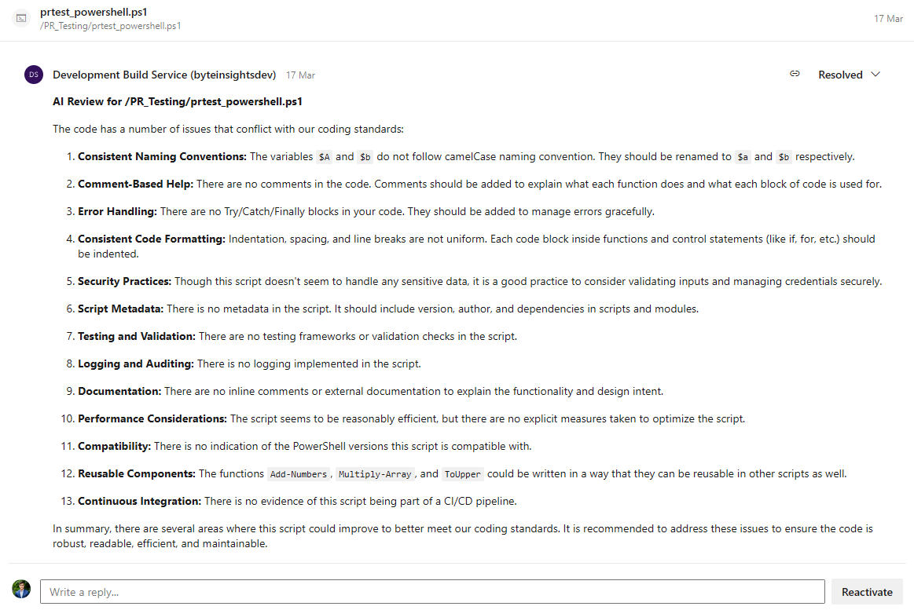
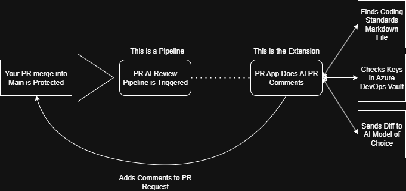
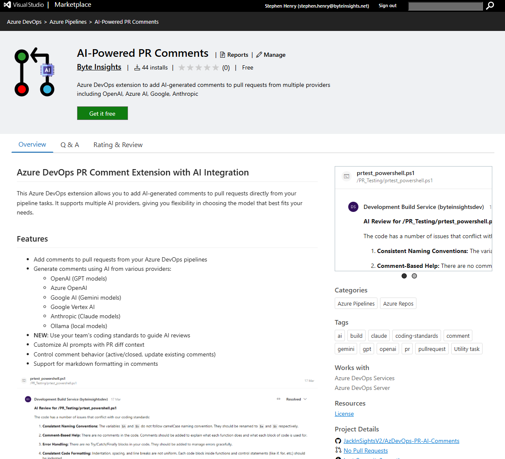
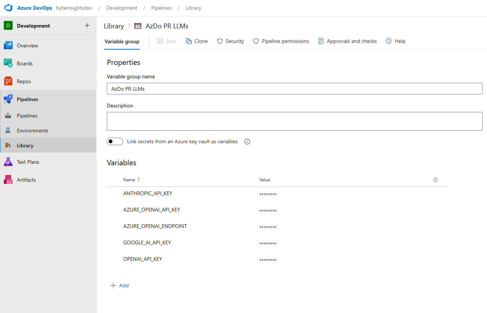
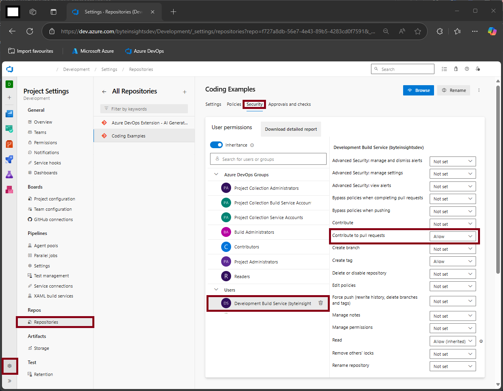

# Azure DevOps PR Comment Extension with AI Integration

[](https://marketplace.visualstudio.com/items?itemName=ByteInSights.AI-PR-Integration)
[](LICENSE.txt)
[](https://dev.azure.com)

This Azure DevOps extension allows you to add AI-generated comments to pull requests directly from your pipeline tasks. It supports multiple AI providers, giving you flexibility in choosing the model that best fits your needs.

https://marketplace.visualstudio.com/items?itemName=ByteInsights.DevOps-AI-PR-Extension

## 📋 Table of Contents

- [Features](#features)
- [How It Works](#how-it-works)
- [Getting Started](#getting-started)
  - [Installation](#installation)
  - [Quick Setup](#quick-setup)
  - [Configuration Options](#configuration-options)
- [Examples](#examples)
- [Creating Coding Standards](#creating-coding-standards)
- [Setting Up API Keys](#setting-up-api-keys)
- [Troubleshooting](#troubleshooting)
- [Development](#development)
- [Contributing](#contributing)
- [License](#license)

## Features

- Add comments to pull requests from your Azure DevOps pipelines
- Generate comments using AI from various providers:
  - OpenAI (GPT models)
  - Azure OpenAI
  - Google AI (Gemini models)
  - Google Vertex AI
  - Anthropic (Claude models)
  - Ollama (local models)
- **NEW**: Use your team's coding standards to guide AI reviews
- **NEW**: Switch between full-file assessments and diff-only reviews
- **NEW**: Post AI feedback as inline PR comments on the touched lines
- Customize AI prompts with PR diff context
- Control comment behavior (active/closed, update existing comments)
- Support for markdown formatting in comments



### How It Works

1. Create a markdown file with your team's coding standards (Keep it simple; have a look at the examples folder)
2. Reference this file in your pipeline task configuration
3. The AI model will use these standards when reviewing code changes
4. Receive tailored feedback that follows your team's guidelines



See the [examples/CODING_STANDARDS_GUIDE.md](examples/CODING_STANDARDS_GUIDE.md) for detailed instructions and best practices.

## Getting Started

### Installation

1. Install the extension from the [Visual Studio Marketplace](https://marketplace.visualstudio.com/items?itemName=ByteInSights.AI-PR-Integration)
2. **Permissions**: Your Azure DevOps build service needs `Contribute to pull requests` permissions (see [Troubleshooting](#troubleshooting) for setup details)




### Quick Setup

Add the task to your Azure Pipelines YAML:

```yaml
- task: prAiProvider@1
  displayName: 'Add AI Comment to PR'
  inputs:
    useAIGeneration: true
    aiProvider: 'openai'
    modelName: 'gpt-4'
    apiKey: '$(OPENAI_API_KEY)'
    codingStandardsFile: '$(Build.SourcesDirectory)/docs/coding-standards.md' # Path to your coding standards file 
    promptTemplate: |
      Review the following code changes according to our coding standards:
      
      CODING STANDARDS:
      {standards}
      
      CODE CHANGES:
      {diff}
      
      ANALYSIS MODE: {analysisMode}
    maxTokens: '1000'
    temperature: '0.7'
    analyzeChangesOnly: true          # Only send the diff hunks to the AI
    enableInlineComments: true        # Leave inline comments anchored to the changed lines
    active: true
    allowedFileExtensions: '.cs, .sql, .ts, .js, .html' 
    exclusionString: 'ai-pr-ignore' 
```

> **💡 Pro Tip**: Using `@1` (major version) automatically gets the latest compatible version. Avoid using specific versions like `@1.0.13` to get automatic updates. 

### Configuration Options

#### AI Generation Options

- **useAIGeneration**: Enable AI-generated comments
- **aiProvider**: Select the AI provider (openai, azure, google, vertexai, anthropic, ollama)
- **modelName**: Specify the model name (e.g., gpt-4, claude-3-opus, gemini-pro)
- **apiKey**: API key for the selected provider (use pipeline variables for security)
- **azureApiEndpoint**: Custom API endpoint URL for Azure OpenAI
- **ollamaApiEndpoint**: API endpoint URL for Ollama (default: http://localhost:11434)
- **codingStandardsFile**: Path to a markdown file containing coding standards to guide the AI
- **promptTemplate**: Template for the AI prompt (use {diff} to include PR changes and {standards} to include coding standards)
- **promptTemplate placeholders**: `{diff}` inserts either the full file or the diff hunk, `{standards}` injects your coding standards, `{analysisMode}` resolves to `full` or `diff`
- **maxTokens**: Maximum number of tokens for the AI response
- **temperature**: Controls randomness in the AI response (0.0-1.0)
- **maxFileSizeInLines**: Maximum number of lines sent per file or diff hunk (oversized inputs are truncated with a notice)
- **analyzeChangesOnly**: When `true`, only the changed lines are analyzed; when `false`, the full file content is sent
- **allowedFileExtentions**: Only files with these extentions will be included in the pr review
- **exclusionString**: Files with this string in their content will be excluded from the pr review

#### Comment Options

- **comment**: Static comment text (when not using AI generation)
- **markdownFile**: Path to a markdown file for comment content
- **active**: Add comment as active (true) or closed (false)
- **addCommentOnlyOnce**: Only add comment if it doesn't already exist
- **updatePreviousComment**: Update existing comment if it exists
- **pullRequestId**: Target pull request ID (defaults to current PR)
- **repositoryId**: Target repository ID (defaults to current repo)
- **enableInlineComments**: When `true`, AI feedback is left as inline review comments on the diff; otherwise a file-level thread is created


## Examples

### Using OpenAI with Coding Standards

```yaml
- task: prAiProvider@1
  inputs:
    useAIGeneration: true
    aiProvider: 'openai'
    modelName: 'gpt-5-nano-2025-08-07'
    apiKey: '$(OPENAI_API_KEY)'
    codingStandardsFile: '$(Build.SourcesDirectory)/docs/coding-standards.md'
    promptTemplate: |
      You are a code reviewer following our team's coding standards.
      
      CODING STANDARDS:
      {standards}
      
      Review the following code changes and provide constructive feedback:
      {diff}
```

For a complete working example, see the [examples/Pipelines/testing_pr.yaml](examples/Pipelines/testing_pr.yaml) file.

### Using Azure OpenAI

```yaml
- task: prAiProvider@1
  inputs:
    useAIGeneration: true
    aiProvider: 'azure'
    modelName: 'gpt-5-nano' 
    apiKey: '$(AZURE_OPENAI_API_KEY)'
    azureApiEndpoint: 'https://your-resource.openai.azure.com'
    promptTemplate: 'Review this code for performance issues: {diff}'
```

### Using Anthropic Claude

```yaml
- task: prAiProvider@1
  inputs:
    useAIGeneration: true
    aiProvider: 'anthropic'
    modelName: 'claude-3-opus-20240229'
    apiKey: '$(ANTHROPIC_API_KEY)'
    promptTemplate: 'Review this code for best practices: {diff}'
```

### Using Google AI (Gemini)

```yaml
- task: prAiProvider@1
  inputs:
    useAIGeneration: true
    aiProvider: 'google'
    modelName: 'gemini-2.0-flash'
    apiKey: '$(GOOGLE_AI_API_KEY)'
    promptTemplate: 'Review this code for security issues: {diff}'
```

### Using Ollama (Local Models)

```yaml
- task: prAiProvider@1
  inputs:
    useAIGeneration: true
    aiProvider: 'ollama'
    modelName: 'llama3'
    ollamaApiEndpoint: 'http://localhost:11434'
    promptTemplate: 'Review this code: {diff}'
```

## Creating Coding Standards

### Why Use Coding Standards?

Coding standards help the AI provide more relevant and consistent feedback by understanding your team's specific requirements and preferences.

### Creating Your Standards File

Create a markdown file in your repository with your team's coding standards. Keep it simple and focused:

```markdown
# Team Coding Standards

## Naming Conventions
- Use camelCase for variables and functions
- Use PascalCase for classes and interfaces
- Use UPPER_SNAKE_CASE for constants

## TypeScript Best Practices
- Always specify return types for functions
- Prefer interfaces over type aliases for object types
- Use optional chaining and nullish coalescing when appropriate

## Code Organization
- Group related functions together
- Keep files under 300 lines when possible
- Use meaningful comments for complex logic

## Error Handling
- Always catch and handle errors appropriately
- Provide meaningful error messages
- Use typed errors when possible
```

### Example Standards by Language

We provide example coding standards for different languages in the `/examples/Coding Standards/` folder:

- [TypeScript/JavaScript Standards](examples/Coding%20Standards/cs_javascript.md)
- [Python Standards](examples/Coding%20Standards/cs_python.md)
- [PowerShell Standards](examples/Coding%20Standards/cs_powershell.md)
- [Terraform Standards](examples/Coding%20Standards/cs_terraform.md)
- [Go Standards](examples/Coding%20Standards/cs_go.md)
- [Bicep Standards](examples/Coding%20Standards/cs_bicep.md)

For a comprehensive guide, see the [CODING_STANDARDS_GUIDE.md](examples/CODING_STANDARDS_GUIDE.md).

## Setting Up API Keys

### Method 1: Variable Groups (Recommended)

1. **Navigate to Pipelines → Library**
   - In Azure DevOps, go to **Pipelines** → **Library** → **Variable groups**
   
2. **Create a New Variable Group**
   - Click **+ Variable group**
   - Name it (e.g., `AI-API-Keys`)
   
3. **Add API Key as a Secret**
   - Click **Add** → enter the variable name (e.g., `OPENAI_API_KEY`)
   - Enter the API key value
   - Mark as **Keep this value secret**
   
4. **Save and Link to Pipeline**
   ```yaml
   variables:
     - group: 'AI-API-Keys'
   ```



### Method 2: Pipeline Variables

1. **Open the Pipeline**
   - Go to **Pipelines** → select your pipeline → click **Edit**

2. **Add a Pipeline Variable**
   - Click the **Variables** tab (top-right)
   - Click **New variable**
   - Name it (e.g., `OPENAI_API_KEY`)
   - Enter the value and mark as **Keep this value secret**

3. **Reference in YAML**
   ```yaml
   - task: prAiProvider@1
     inputs:
       apiKey: '$(OPENAI_API_KEY)'
   ```

## Troubleshooting

### Common Issues

#### Permission Denied Errors

**Problem**: `The build service does not have permission to contribute to pull requests`

**Solution**: Grant your build service the necessary permissions:

1. Go to **Project Settings** → **Repositories** → **Security**
2. Find your project's build service (e.g., `[Project Name] Build Service`)
3. Set **Contribute to pull requests** to **Allow**



#### API Key Issues

**Problem**: `Invalid API key` or authentication errors

**Solutions**:
- Verify your API key is correctly set as a secret variable
- Check that the variable name matches exactly (case-sensitive)
- Ensure the API key has the necessary permissions for your AI provider

#### AI Provider Specific Issues

##### OpenAI
- Ensure you have sufficient credits in your OpenAI account
- Check rate limits if you're getting timeout errors
- Use `gpt-4o` or `gpt-4o-mini` for best results

##### Azure OpenAI
- Verify your deployment name matches the `modelName` parameter
- Ensure your Azure OpenAI resource is deployed in a supported region
- Check that your API endpoint URL is correct

##### Anthropic (Claude)
- Ensure you have access to the Claude model you're trying to use
- Check your organization's usage limits

### FAQ

**Q: Can I use multiple AI providers in the same pipeline?**
A: Yes, you can add multiple tasks with different providers to get varied feedback.

**Q: How much does it cost to run AI reviews?**
A: Costs depend on your AI provider's pricing. For reference, reviewing a typical PR (~500 lines) costs approximately:
- OpenAI GPT-5-nano: ~$0.01-0.05
- Anthropic Claude: ~$0.02-0.08
- Google Gemini: ~$0.005-0.02

**Q: Can I customize the AI prompt?**
A: Yes, use the `promptTemplate` parameter with `{diff}` for code changes and `{standards}` for coding standards.

**Q: Does this work with private repositories?**
A: Yes, the extension works with both public and private Azure DevOps repositories.

## Development

### Testing AI Services

The project includes a test script to verify AI service integrations:

```powershell
# Install dependencies
npm install

# Build the project
npm run build

# Test AI services (requires API keys)
node scripts/test-ai-services.js
```

This script tests all AI providers and generates sample responses for verification.

## License

This project is licensed under the MIT License - see the LICENSE.txt file for details.
