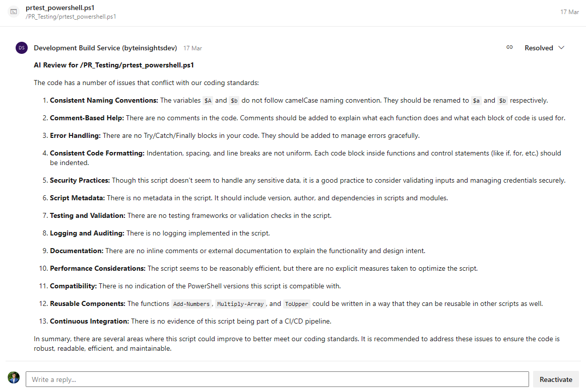
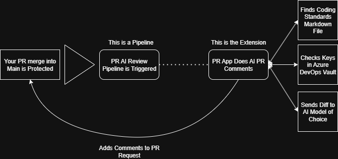
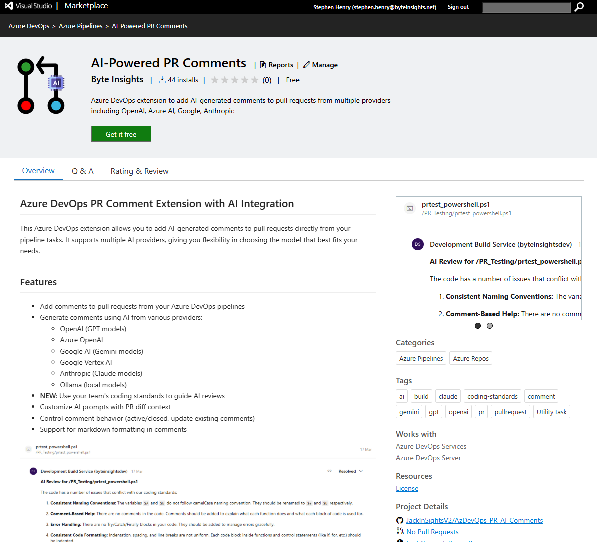
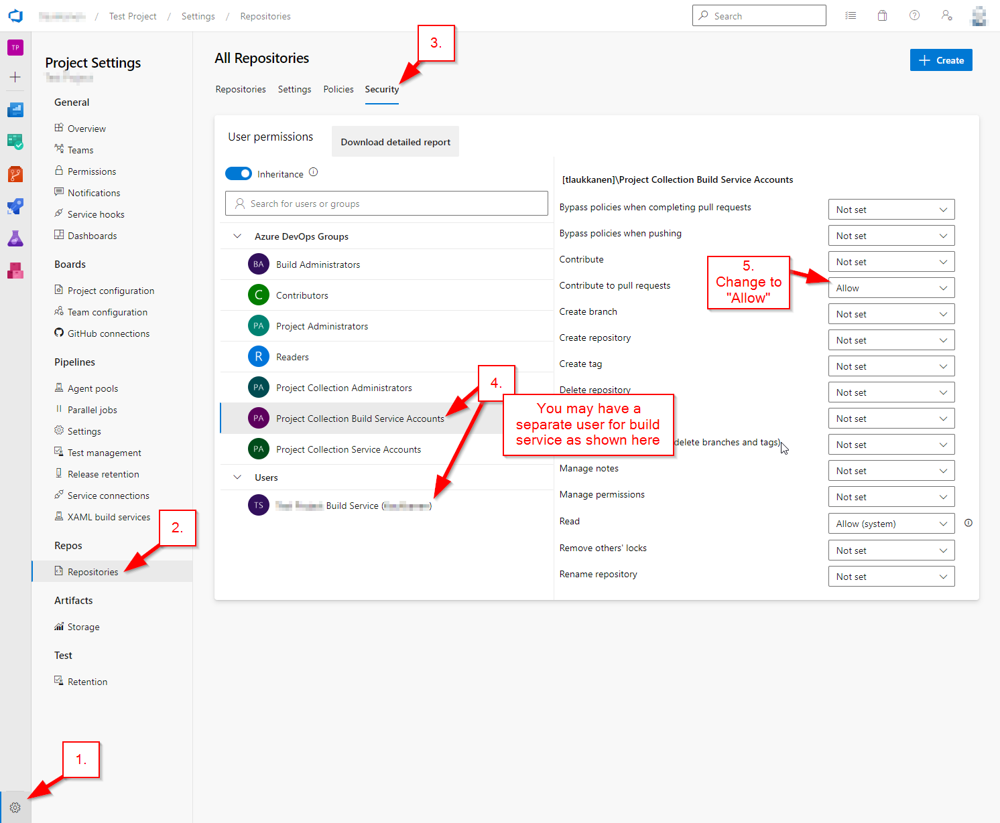
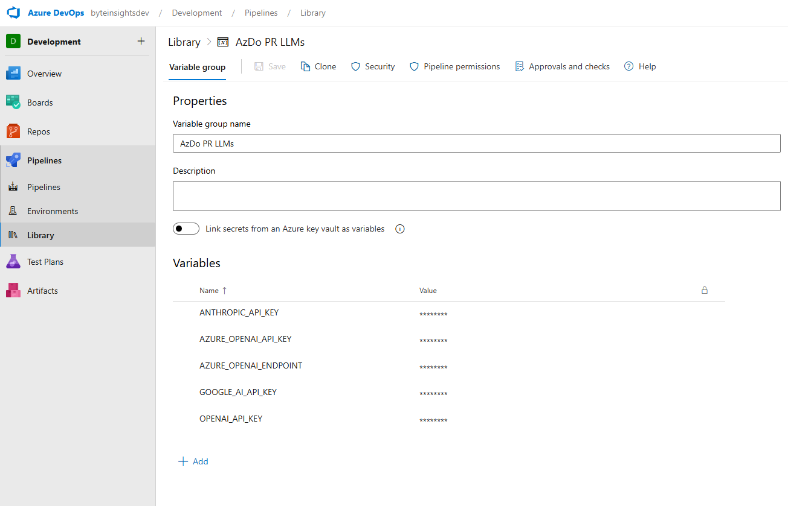
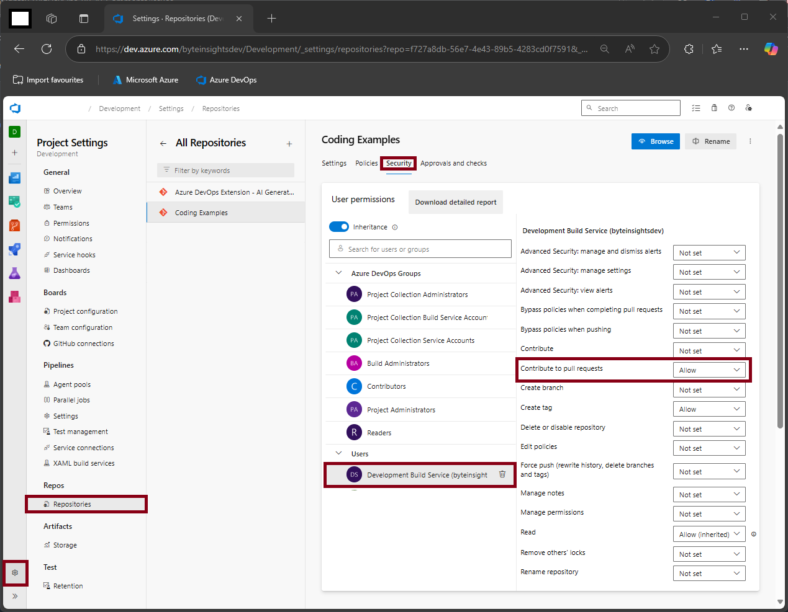

# Azure DevOps PR Comment Extension with AI Integration

[](https://marketplace.visualstudio.com/items?itemName=ByteInSights.DevOps-AI-PR-Extension)
[](LICENSE.txt)
[](https://dev.azure.com)

This Azure DevOps extension adds an AI code reviewer to your pipelines. By default it performs a **holistic review** of the whole pull request — reading every changed file together along with the PR title, description, linked work items, existing human comments, and your coding standards — then posts a single summary thread plus line-anchored findings, each tagged with a severity. It supports multiple AI providers, so you can pick the model that best fits your needs.

https://marketplace.visualstudio.com/items?itemName=ByteInSights.DevOps-AI-PR-Extension

> **⚠️ Upgrading from 1.x?** This is a major version. Azure DevOps keys task references on the major version, so pipelines still using `prAiProvider@1` stay on the latest 1.x and **do not auto-upgrade** — bump the reference to `prAiProvider@2` to get v2. Once on `@2`, holistic review is the default; set `reviewMode: perFile` to keep the old one-comment-per-file behaviour. See [Holistic Review Options](#holistic-review-options).

## 📋 Table of Contents

- [Features](#features)
- [How It Works](#how-it-works)
- [Getting Started](#getting-started)
  - [Installation](#installation)
  - [Quick Setup](#quick-setup)
  - [Configuration Options](#configuration-options)
- [Examples](#examples)
- [Creating Coding Standards](#creating-coding-standards)
- [Setting Up API Keys](#setting-up-api-keys)
- [Troubleshooting](#troubleshooting)
- [Development](#development)
- [License](#license)

## Features

- **Holistic, whole-PR review (default)** — the AI reasons across all changed files at once instead of file-by-file, so it catches cross-file bugs, broken contracts, and changes that don't match the PR's stated intent
- **Severity-rated findings** — each issue is posted as its own line-anchored thread tagged `critical`/`high`/`medium`/`low`/`info`, with a `minSeverity` filter to keep the noise down
- **Single summary thread** — one overview comment per PR summarising the change and its biggest risks
- **Idempotent re-runs** — findings are fingerprinted so the same issue isn't re-posted on every push; the summary is updated in place and findings that no longer apply are auto-closed
- **False-positive suppression** — an optional verification pass asks the model to confirm or drop each candidate finding before it's posted
- **Rich PR context** — the reviewer is given the PR title/description, linked work items (incl. acceptance criteria), existing human comments, and your team's coding standards
- **Large-PR batching** — pull requests over the input budget are split, reviewed in parts, and synthesised into one summary
- **Never blocks the build** — the reviewer is advisory: API errors or unparseable output warn and report `SucceededWithIssues` rather than failing the pipeline
- **Multiple AI providers** — OpenAI, Azure OpenAI, Google AI (Gemini), Google Vertex AI, Anthropic (Claude), and Ollama (local models)
- **Legacy per-file mode** — the original "one comment per file" behaviour is still available via `reviewMode: perFile`, including inline/diff-only comments
- Static (non-AI) comments, markdown file comments, and comment-behaviour controls (active/closed, add-once, update-existing) are still supported



### How It Works

1. Add the `prAiProvider` task to your PR pipeline with `useAIGeneration: true` and an API key for your chosen provider
2. On each PR build the task gathers the full diff plus the PR's context (title, description, linked work items, human comments) and — optionally — your coding standards file
3. The AI reviews the whole change at once and returns a structured set of findings
4. Candidate findings are de-duplicated, optionally verified, filtered by severity, and posted as a summary thread plus line-anchored comments
5. Re-runs reconcile against what's already on the PR — nothing is double-posted, and resolved findings are closed



Coding standards are optional but recommended — see [examples/CODING_STANDARDS_GUIDE.md](examples/CODING_STANDARDS_GUIDE.md) for instructions and best practices.

## Getting Started

### Installation

1. Install the extension from the [Visual Studio Marketplace](https://marketplace.visualstudio.com/items?itemName=ByteInSights.AI-PR-Integration)
2. **Permissions**: Your Azure DevOps build service needs `Contribute to pull requests` permissions (see [Troubleshooting](#troubleshooting) for setup details)




### Quick Setup

Add the task to a pipeline that runs on pull requests (a [branch policy build validation](https://learn.microsoft.com/azure/devops/repos/git/branch-policies) is the usual trigger). The defaults give you a full holistic review — you only need a provider and a key:

```yaml
- task: prAiProvider@2
  displayName: 'AI PR Review'
  inputs:
    useAIGeneration: true
    aiProvider: 'openai'
    modelName: 'gpt-5.4'                 # leave empty for the provider's current default
    apiKey: '$(OPENAI_API_KEY)'
    # --- everything below is optional ---
    codingStandardsFile: '$(Build.SourcesDirectory)/docs/coding-standards.md'
    minSeverity: 'low'                   # suppress findings below this severity
    enableVerification: true            # confirm-or-drop pass to cut false positives
    skipDraftPullRequests: true
    active: true                         # post finding threads as Active (unresolved)
```

That's it — no prompt template required. In holistic mode the task assembles its own review prompt and structured-output contract; `customInstructions` is the supported way to add guidance (see below).

> **💡 Pro Tip**: Pin to the major version (`@2`) to automatically receive compatible updates. Avoid pinning a full version like `@2.0.0` unless you need to lock behaviour.

### Configuration Options

#### AI Generation Options (all modes)

- **useAIGeneration**: Enable AI-generated comments
- **aiProvider**: Select the AI provider (`openai`, `azure`, `google`, `vertexai`, `anthropic`, `ollama`)
- **modelName**: Model name (e.g. `gpt-5.4`, `claude-sonnet-4-6`, `gemini-3-pro`, `qwen3`). Leave empty for the provider's current default.
- **apiKey**: API key for the selected provider (use a secret pipeline variable). Not required for Ollama.
- **azureApiEndpoint**: Custom API endpoint URL for Azure OpenAI
- **ollamaApiEndpoint**: API endpoint URL for Ollama (default: `http://localhost:11434`)
- **codingStandardsFile**: Path to a markdown file of coding standards fed to the reviewer
- **maxTokens**: Maximum tokens for each AI response. Holistic reviews need headroom for a summary plus multiple findings (default `8000`).
- **temperature**: Controls randomness in the AI response (0.0–1.0). Ignored by newer models that only accept their default temperature.
- **maxFileSizeInLines**: Maximum lines included from any single file/diff; oversized inputs are truncated with a notice
- **allowedFileExtensions**: Comma-separated list — only files with these extensions are reviewed (per-file mode)
- **exclusionString**: Files whose content contains this string are skipped (per-file mode)

#### Holistic Review Options

When AI generation is enabled, the task defaults to a **holistic review**: the AI sees the entire pull request at once (all changed files plus the PR title/description, linked work items, existing human comments, and your coding standards), then posts a single summary thread plus line-anchored findings, each with a severity. Re-runs are deduplicated by a content fingerprint, so the same finding is not re-posted on every push and findings that no longer apply are closed.

- **reviewMode**: `holistic` (default — whole-PR review with a summary + line-anchored findings) or `perFile` (the legacy behaviour that comments on each file independently). Existing pipelines that relied on the per-file behaviour can set `reviewMode: perFile`.
- **minSeverity**: Findings below this severity (`info`, `low`, `medium`, `high`, `critical`) are not posted; the count of suppressed findings is noted in the summary. Default `low`.
- **customInstructions**: Optional free-text guidance injected into the review prompt (e.g. "Focus on security; this is a React 18 codebase"). Do **not** use it to dictate output format.
- **enableVerification**: When `true` (default), candidate findings are sent back to the model for a confirm-or-drop pass to suppress false positives (roughly doubles token cost).
- **maxInputTokens**: Approximate input budget (chars/4) for a single review call. Pull requests larger than this are split into batches that are reviewed separately and then synthesised. Default `200000`.
- **skipDraftPullRequests**: When `true`, the holistic review is skipped for draft PRs.
- **debug**: When `true`, assembled prompts are written to the agent temp directory for troubleshooting.

> In holistic mode the **promptTemplate** is only used if you customise it away from the default; the legacy `{diff}` placeholders are not substituted (the task assembles its own file context), and the structured JSON output contract is always enforced. If a malfunction occurs (API error, unparseable output), the task warns and reports `SucceededWithIssues` rather than failing the build — findings never gate the pipeline.

#### Per-file (legacy) Options

These apply only when `reviewMode: perFile`. They are ignored in holistic mode, which assembles its own annotated-diff prompt.

- **promptTemplate**: Template for the per-file AI prompt. Placeholders: `{diff}` (the file content or diff hunk), `{standards}` (your coding standards), `{analysisMode}` (`full` or `diff`).
- **analyzeChangesOnly**: When `true`, only the changed lines are sent to the AI; when `false`, the full file content is sent
- **enableInlineComments**: When `true` (and `analyzeChangesOnly` is also `true`), feedback is anchored as inline comments on the changed lines; otherwise a file-level thread is created

#### Comment Options

- **comment**: Static comment text (when `useAIGeneration` is off)
- **markdownFile**: Path to a markdown file used as the comment body (when `useAIGeneration` is off)
- **active**: Post threads as active/unresolved (`true`) or closed (`false`)
- **addCommentOnlyOnce**: Only add the static comment if one doesn't already exist
- **updatePreviousComment**: Update the existing static comment in place if present
- **pullRequestId**: Target pull request ID (defaults to the current PR)
- **repositoryId**: Target repository ID (defaults to the current repo)


## Examples

All examples below run a **holistic review** (the default). For a complete working pipeline, see [examples/Pipelines/testing_pr.yaml](examples/Pipelines/testing_pr.yaml).

### Holistic review with coding standards and custom focus

```yaml
- task: prAiProvider@2
  inputs:
    useAIGeneration: true
    aiProvider: 'openai'
    modelName: 'gpt-5.4'
    apiKey: '$(OPENAI_API_KEY)'
    codingStandardsFile: '$(Build.SourcesDirectory)/docs/coding-standards.md'
    customInstructions: 'Focus on security and data-access correctness. This is a .NET 8 + EF Core service.'
    minSeverity: 'medium'        # only post medium and above
    active: true
```

### Using Azure OpenAI

```yaml
- task: prAiProvider@2
  inputs:
    useAIGeneration: true
    aiProvider: 'azure'
    modelName: 'gpt-5'           # your deployment name
    apiKey: '$(AZURE_OPENAI_API_KEY)'
    azureApiEndpoint: 'https://your-resource.openai.azure.com'
```

### Using Anthropic Claude

```yaml
- task: prAiProvider@2
  inputs:
    useAIGeneration: true
    aiProvider: 'anthropic'
    modelName: 'claude-sonnet-4-6'
    apiKey: '$(ANTHROPIC_API_KEY)'
```

### Using Google AI (Gemini)

```yaml
- task: prAiProvider@2
  inputs:
    useAIGeneration: true
    aiProvider: 'google'
    modelName: 'gemini-3-pro'
    apiKey: '$(GOOGLE_AI_API_KEY)'
```

### Using Ollama (local models, no API key)

```yaml
- task: prAiProvider@2
  inputs:
    useAIGeneration: true
    aiProvider: 'ollama'
    modelName: 'qwen3'
    ollamaApiEndpoint: 'http://localhost:11434'
```

### Legacy per-file mode

The original behaviour — one comment per changed file, with an optional custom prompt and inline anchoring:

```yaml
- task: prAiProvider@2
  inputs:
    useAIGeneration: true
    reviewMode: 'perFile'
    aiProvider: 'openai'
    modelName: 'gpt-5.4'
    apiKey: '$(OPENAI_API_KEY)'
    analyzeChangesOnly: true      # send only the diff hunks
    enableInlineComments: true    # anchor comments to the changed lines
    promptTemplate: |
      You are a code reviewer following our team's coding standards.

      CODING STANDARDS:
      {standards}

      Review the following code changes and provide constructive feedback:
      {diff}
    codingStandardsFile: '$(Build.SourcesDirectory)/docs/coding-standards.md'
    allowedFileExtensions: '.cs,.ts,.js,.sql'
    exclusionString: 'ai-pr-ignore'
```

## Creating Coding Standards

### Why Use Coding Standards?

Coding standards help the AI provide more relevant and consistent feedback by understanding your team's specific requirements and preferences.

### Creating Your Standards File

Create a markdown file in your repository with your team's coding standards. Keep it simple and focused:

```markdown
# Team Coding Standards

## Naming Conventions
- Use camelCase for variables and functions
- Use PascalCase for classes and interfaces
- Use UPPER_SNAKE_CASE for constants

## TypeScript Best Practices
- Always specify return types for functions
- Prefer interfaces over type aliases for object types
- Use optional chaining and nullish coalescing when appropriate

## Code Organization
- Group related functions together
- Keep files under 300 lines when possible
- Use meaningful comments for complex logic

## Error Handling
- Always catch and handle errors appropriately
- Provide meaningful error messages
- Use typed errors when possible
```

### Example Standards by Language

We provide example coding standards for different languages in the `/examples/Coding Standards/` folder:

- [TypeScript/JavaScript Standards](examples/Coding%20Standards/cs_javascript.md)
- [Python Standards](examples/Coding%20Standards/cs_python.md)
- [PowerShell Standards](examples/Coding%20Standards/cs_powershell.md)
- [Terraform Standards](examples/Coding%20Standards/cs_terraform.md)
- [Go Standards](examples/Coding%20Standards/cs_go.md)
- [Bicep Standards](examples/Coding%20Standards/cs_bicep.md)

For a comprehensive guide, see the [CODING_STANDARDS_GUIDE.md](examples/CODING_STANDARDS_GUIDE.md).

## Setting Up API Keys

### Method 1: Variable Groups (Recommended)

1. **Navigate to Pipelines → Library**
   - In Azure DevOps, go to **Pipelines** → **Library** → **Variable groups**
   
2. **Create a New Variable Group**
   - Click **+ Variable group**
   - Name it (e.g., `AI-API-Keys`)
   
3. **Add API Key as a Secret**
   - Click **Add** → enter the variable name (e.g., `OPENAI_API_KEY`)
   - Enter the API key value
   - Mark as **Keep this value secret**
   
4. **Save and Link to Pipeline**
   ```yaml
   variables:
     - group: 'AI-API-Keys'
   ```



### Method 2: Pipeline Variables

1. **Open the Pipeline**
   - Go to **Pipelines** → select your pipeline → click **Edit**

2. **Add a Pipeline Variable**
   - Click the **Variables** tab (top-right)
   - Click **New variable**
   - Name it (e.g., `OPENAI_API_KEY`)
   - Enter the value and mark as **Keep this value secret**

3. **Reference in YAML**
   ```yaml
   - task: prAiProvider@2
     inputs:
       apiKey: '$(OPENAI_API_KEY)'
   ```

## Troubleshooting

### Common Issues

#### Permission Denied Errors

**Problem**: `The build service does not have permission to contribute to pull requests`

**Solution**: Grant your build service the necessary permissions:

1. Go to **Project Settings** → **Repositories** → **Security**
2. Find your project's build service (e.g., `[Project Name] Build Service`)
3. Set **Contribute to pull requests** to **Allow**



#### API Key Issues

**Problem**: `Invalid API key` or authentication errors

**Solutions**:
- Verify your API key is correctly set as a secret variable
- Check that the variable name matches exactly (case-sensitive)
- Ensure the API key has the necessary permissions for your AI provider

#### AI Provider Specific Issues

##### OpenAI
- Ensure you have sufficient credits in your OpenAI account
- Check rate limits if you're getting timeout errors
- A capable model (e.g. `gpt-5.4`) gives the best holistic-review results; newer reasoning models only accept their default temperature, which the task handles automatically

##### Azure OpenAI
- Verify your deployment name matches the `modelName` parameter
- Ensure your Azure OpenAI resource is deployed in a supported region
- Check that your API endpoint URL is correct

##### Anthropic (Claude)
- Ensure you have access to the Claude model you're trying to use
- Check your organization's usage limits

### FAQ

**Q: Can I use multiple AI providers in the same pipeline?**
A: Yes, you can add multiple tasks with different providers to get varied feedback.

**Q: How much does it cost to run AI reviews?**
A: Costs depend on your AI provider's pricing. For reference, reviewing a typical PR (~500 lines) costs approximately:
- OpenAI GPT-5-nano: ~$0.01-0.05
- Anthropic Claude: ~$0.02-0.08
- Google Gemini: ~$0.005-0.02

**Q: Can I customize what the AI looks for?**
A: In holistic mode (default), use `customInstructions` for free-text guidance (e.g. focus areas, framework/version context) and `codingStandardsFile` for your standards — the structured output format is managed for you. The `{diff}`/`{standards}` `promptTemplate` placeholders apply only to `reviewMode: perFile`.

**Q: Will a finding block my pipeline?**
A: No. The reviewer is advisory. On an API error or unparseable output it warns and reports `SucceededWithIssues`; it never fails the build.

**Q: Does it re-post the same comments on every push?**
A: No. Findings are fingerprinted and reconciled on each run — existing findings are left alone, the summary is updated in place, and findings that no longer apply are closed.

**Q: Does this work with private repositories?**
A: Yes, the extension works with both public and private Azure DevOps repositories.

## Development

The repo uses [Bun](https://bun.sh) (`bun.lock` is the source of truth; scripts also work under npm).

```bash
bun install            # install dependencies
npx tsc --noEmit       # typecheck
bun test               # run the unit test suite (tests/)
bun run build          # clean → tsc → copy task.json → bundle deps into dist/
```

The test suite in [tests/](tests/) covers the holistic review orchestrator (batching, anchor resolution, fingerprint dedup, JSON parsing), the comment poster (post/update/close reconciliation), and the diff utilities. The same typecheck + `bun test` gate runs in CI on every push/PR ([.github/workflows/ci.yml](.github/workflows/ci.yml)) and again before a tagged release is published to the marketplace ([.github/workflows/marketplace-deploy.yml](.github/workflows/marketplace-deploy.yml)).

### Testing AI provider connectivity

To smoke-test live calls against every provider (requires API keys in `config.json` or environment variables):

```bash
node scripts/test-ai-services.js
```

## License

This project is licensed under the MIT License - see the LICENSE.txt file for details.
